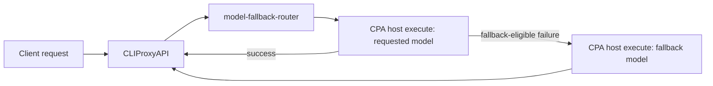

# CPA Model Fallback Router

[](https://github.com/thebtf/cpa-model-fallback-router/actions/workflows/test.yml)
[](https://github.com/thebtf/cpa-model-fallback-router/actions/workflows/release.yml)
[](https://github.com/thebtf/cpa-model-fallback-router/releases/latest)
[](LICENSE)

CPA Model Fallback Router is a native CLIProxyAPI plugin that retries matching model requests with configured fallback model names. It supports cross-model fallback and same-model capacity retries for any CPA-supported model, with bounded exponential backoff, primary cooldowns, and streaming error detection.

The plugin is intentionally model-name based. It asks CPA to execute the original requested model first, then retries configured fallback models when the first attempt fails with a fallback-eligible HTTP status, transport error, quota error, or rate-limit error. It never calls providers directly: every attempt goes back through CPA, which keeps provider selection, credentials, protocol conversion, logging, and accounting in the host.

## Quick Start

1. Download the zip for the CPA host platform from the [latest GitHub release](https://github.com/thebtf/cpa-model-fallback-router/releases/latest).
2. Verify it against the release `checksums.txt`.
3. Extract the archive; it contains the correctly named plugin library at the zip root.
4. Put the extracted library in CPA's configured plugin directory.
5. Enable the plugin under `plugins.configs.model-fallback-router`.

For the official Linux Docker image, the final mounted file commonly looks like this inside the container:

```text
/app/plugins/model-fallback-router.so
```

## Features

- Model-name fallback rules with `*` wildcard matching.
- Ordered fallback chains across any CPA-supported models.
- Global or rule-level fallback status and cooldown policies.
- Primary-model cooldown that sends later requests directly to fallback models after a fallback-eligible primary failure.
- Streaming retries before the first client-visible content event, with a retry exception for recognized transient upstream disconnects.
- Optional disabled-by-default execution transform for Claude, OpenAI Chat Completions, and OpenAI Responses requests routed to selected models.
- Safe dry-run and privacy-preserving telemetry modes for evaluating transforms before mutation.
- Audited `ExitContinuationTool` support with validated non-streaming exit unwrapping.
- CPA store compatible release zips plus `checksums.txt`.
- Redoc-rendered configuration reference in `docs/index.html`.

## Compatibility

- Built for the CPA native plugin ABI from `github.com/router-for-me/CLIProxyAPI/v7`.
- Tested during extraction against the CPA v7.2.x plugin API.
- Current CPA plugin host callbacks do not expose the selected auth record or auth kind to plugin executors. Because of that, this plugin can scope by requested model and inbound source format, but cannot yet scope a rule to `anthropic oauth` versus an Anthropic API key.

## Configuration

```yaml
plugins:
  enabled: true
  dir: "/app/plugins"
  configs:
    model-fallback-router:
      enabled: true
      priority: 100

      rules:
        - name: claude_quota_to_gpt54
          source_formats:
            - claude
            - anthropic
          models:
            - claude-*
          primary_model: "$requested"
          fallback_models:
            - gpt-5.4
          execution_transform:
            enabled: true
            activation: tool_surface
            force_tools: when_available
            selected_model_patterns:
              - gpt-*

      execution_transform:
        enabled: false
        telemetry: true
        activation: tool_surface
        force_tools: when_available
        execution_envelope: >-
          Execution mode is active for an agent harness turn routed to GPT.
          Execute a real state-changing tool call before prose; do not stop at
          "next step" or "currently doing" narration.

      fallback:
        enabled: true
        retry_base_ms: 10000
        retry_max_ms: 160000
        max_elapsed_seconds: 1200
        cooldown_seconds: 60
        fallback_on_status:
          - 401
          - 403
          - 408
          - 409
          - 429
          - 500
          - 502
          - 503
          - 504
        no_fallback_on_status:
          - 400
          - 404
          - 422
```

## Configuration Rules

Upstream `context deadline exceeded` errors are retryable, including when CPA
passes only the error text without an HTTP status. HTTP 502 is fallback-eligible
by default, subject to the configured terminal status list.

Retry timing is configured under `fallback`: `retry_base_ms` (default 10000),
`retry_max_ms` (default and maximum 160000), and `max_elapsed_seconds`
(default 1200).
Exponential delays use equal jitter (half to full delay) and apply between
attempts, including repeated `$requested` entries. Ten repeated entries mean
ten retries plus the initial attempt. The deadline includes generation time;
increase it for long-running responses (maximum 3600 seconds). After an upstream
network/deadline failure consumes the chain budget, a remaining attempt may use
a separate 15-second recovery window.

The stream runner preserves complete SSE line boundaries, buffers transport
prelude events, and detects structured errors even when the upstream opened
with HTTP 200. Non-streaming structured error bodies are likewise classified
as failures even when CPA reports HTTP 200. It does not emit empty disconnect probes. Cancellation stops
backoff and closes an active model stream. The native ABI cannot forcibly interrupt a
synchronous host callback: the plugin stops waiting at its deadline, closes
late stream-open results, and leaves non-stream upstream cancellation to CPA.

Failure logs contain a callback request ID, attempt/limit, elapsed time, delay,
error category, allowlisted error code, and stop reason. They exclude raw
prompts and error bodies. Enable CPA `logging-to-file` with a finite
`logs-max-total-size-mb` to retain this trail. An exhausted capacity retry and
a non-retryable `model_not_found` require different remedies; missing provider
routing is not repaired by repeating the same model.

- `rules[].models` matches the client-requested model case-insensitively with `*` wildcards. Enabled configurations require at least one rule, and each rule requires a name, model pattern, and fallback entry.
- Rules are first-match-wins. Put narrow model patterns before broader patterns such as `*`.
- Unknown YAML keys are ignored for CPA and legacy-config compatibility, so copy documented field names exactly.
- `rules[].source_formats` optionally limits the inbound protocol. `anthropic` is normalized to `claude`.
- Omit `source_formats` to make a rule protocol-global.
- `primary_model` defaults to `$requested`, which means the original requested model. Set a concrete model name to route the first attempt to a different model. `fallback.enabled: false` disables retries while retaining the matched primary attempt.
- `fallback_models` are tried in order. Every attempt must fail with a fallback-eligible status or error before the next model is tried.
- Repeating a model name in `fallback_models` is honored, which is how a rule requests same-model retries (`primary_model: "$requested"` plus repeated `$requested` entries).
- Rule-level `fallback_on_status`, `no_fallback_on_status`, and `cooldown_seconds` override the global fallback policy for that rule.
- `cooldown_seconds` defaults to `60`; set it to `0` globally or per rule to disable primary-model cooldown.
- Cooldown is held in memory and scoped by source format, rule name, and primary model; it resets on reconfiguration or shutdown. During cooldown, the plugin skips the primary model and any matching primary entries in the fallback list when a distinct fallback exists. Same-model-only chains remain usable during cooldown.
- Non-streaming requests can fall back after a failed response.
- Streaming requests fall back when the failure happens before the first client-visible content event is emitted. Transport prelude events such as `response.created` are held back until real content arrives, so an overload reported after the stream opens can still be retried. The transient Codex server error `An error occurred while processing your request...` is also retried after emission because clients surface it as a reconnectable stream disconnect.
- If CPA loses the numeric HTTP status, or preserves one that the configured status lists do not name, but the error text clearly indicates rate limiting, quota exhaustion, auth unavailability, model cooldown, model/provider unavailability, or an operator-disabled account, the plugin treats the failure as fallback eligible. Recognized context-window and cyber-policy `400` responses are also eligible; other explicit `no_fallback_on_status` entries still win over matching text.
- `execution_transform` is disabled by default. Configure it globally, then enable it narrowly per rule for the harness routes that should enforce action-or-audited-exit behavior. Settings are layered as defaults, global values, then rule values. `activation: tool_surface` requires tools in the request; `activation: always` removes the tool-surface activation check; protocol/model filters, post-tool bypass, and the `force_tools` policy still apply.
- `force_tools` accepts `never`, `when_available` (the default), or `always_if_supported`. The transform can inject an operator-editable `execution_envelope`, add a named audited exit tool, require tool choice, and cap the envelope with `max_envelope_chars` (256–8000, or `0` for no cap).
- `dry_run: true` evaluates and reports transform decisions without changing request bodies. `telemetry: true` emits only model/protocol/decision metadata; raw prompts, bodies, and tool schemas are excluded. `strict: true` turns an unsafe or unsupported transform into an attempt error; the default is to bypass that transform and continue with the original body.
- `activation` controls when a matched rule becomes an execution turn. Use `tool_surface` for normal harness traffic: after source/model rule matching, transform only requests that expose tools, without matching prompt phrases. Use `always` only for tightly scoped rules where every matched request is intentionally an execution turn.
- Structural post-tool continuation turns are bypassed before mutation, so `tool_surface` does not keep forcing another tool call after a Claude `tool_result` or OpenAI tool/function output.
- Cross-model routing keeps conversion inside CPA: the plugin sends the host executor the body protocol it is mutating as `EntryProtocol` and the downstream client protocol as `ExitProtocol`, so CPA's built-in translators handle Claude/OpenAI/Gemini/Codex request and response shapes.
- `execution_envelope` is intentionally operator-editable. Tune it when a fallback model says what it will do instead of making the tool call or state update in the current turn.
- Transform filters default to `source_formats: [claude]`, `requested_model_patterns: ["claude-*"]`, and `selected_model_patterns: ["gpt-*"]`. Set all three explicitly for other routes. Empty lists inherit the previous layer; use `["*"]` for unrestricted model matching.
- Streaming requests receive only the request transform before stream start; audited exit response unwrapping is non-streaming only in this version. The exit tool is unwrapped only when the plugin added that tool for the current attempt, and only a single valid exit call in Claude or OpenAI Chat responses is converted to its `user_response`. OpenAI Responses exits remain tool calls.

## ChatGPT subscription API errors handled by the router

The router does not depend on one provider JSON schema. It classifies the error text and structured stream records that CLIProxyAPI can return from the ChatGPT/Codex subscription path. With the default policy, these cases advance to the next configured model:

| Error family | Recognized status or text | Handling |
| --- | --- | --- |
| HTTP fallback statuses | `401`, `403`, `408`, `409`, `429`, `500`, `502`, `503`, `504` | Retry/fallback by default. The lists can be replaced globally or per rule. |
| Rate limit and quota | `rate limit`, `ratelimit`, `too many requests`, `quota`, `exceed your account` | Retry even when CPA does not preserve a matching numeric status. |
| ChatGPT transient server failure | `An error occurred while processing your request` | Retry, including after a stream has emitted content when the client reports a reconnectable disconnect. |
| Stream disconnect | `stream disconnected before completion` | Retry as a transient upstream failure. |
| Model capacity and overload | `server_is_overloaded`, `model_at_capacity`, `selected model is at capacity`, `model is at capacity`, `at capacity. please try a different model`, `servers are currently overloaded`, `currently overloaded`, `server is overloaded`, `model is overloaded` | Retry capacity failures, including JSON/SSE failures returned after HTTP 200. |
| Provider/account availability | `unknown provider`, `no provider for model`, `provider unavailable`, `model unavailable` | Retry when the selected provider or model is unavailable. |
| Authentication/account availability | `auth_not_found`, `auth_unavailable`, `model_cooldown`, `no auth available`, `no active auth`, `no available auth`, `no active account`, `no available account`, `account disabled`, `auth disabled`, `credential disabled`, `credentials disabled` | Retry through the next configured model (while CPA remains responsible for account selection) and mark the primary model cooldown when applicable. |
| Context-window exhaustion | `prompt is too long`, `context_length_exceeded`, `maximum context`, `context window`, `context length` with `exceed` or `too long`, or `tokens >` with `maximum` | Retry even for HTTP `400` or an otherwise status-less error. |
| Codex cyber-policy rejection | `cyber_policy`, `cyber policy`, `cybersecurity risk`, or high-risk cyber activity wording | Retry through the configured fallback chain, including when CPA preserves HTTP `400`. |
| Transport/deadline failures | context deadline, timeout, timed out, connection reset/refused/aborted, broken pipe, no such host, DNS failure, temporary failure, network unreachable, EOF | Retry when the failure is not a client cancellation. |

Capacity and overload failures are also inspected in streamed records such as `event: error` or `event: response.failed` with `data` containing `server_is_overloaded`, `model_at_capacity`, or an error message. Structured JSON error bodies are inspected even when CPA reports HTTP `200`. The stream gate holds transport prelude records until it sees content, so these failures remain retryable before the first client-visible payload.

The default terminal statuses are `400`, `404`, and `422`. Recognized context-window and cyber-policy `400` responses remain retryable because the selected fallback model may still serve the request. An explicitly configured `no_fallback_on_status` entry applies to other matching errors. An unrecognized error with an unlisted status is returned to the client rather than retried. Client cancellation is never treated as a provider failure and is not retried.

### Multi-stage fallback chain

This rule sends `kimi-k3` to the requested model first, then to `grok-4.5`, and finally to `gpt-5.6-luna` when each preceding attempt fails with a fallback-eligible error:

```yaml
rules:
  - name: kimi_to_grok_then_luna
    models: ["kimi-*"]
    primary_model: "$requested"
    fallback_models:
      - grok-4.5
      - gpt-5.6-luna
```

The omitted `source_formats` makes the rule apply to every inbound protocol. Put it before any broader rule that can also match `kimi-*`. Quota status `429` advances the chain by default; terminal statuses such as `400`, `404`, and `422` do not, except a recognized context-window `400`.

### Same-model capacity retries

Repeat `$requested` to retry the same model rather than change models. This
example allows four attempts in total and disables primary cooldown:

```yaml
rules:
  - name: gpt_capacity_retry
    models: ["gpt-*"]
    primary_model: "$requested"
    fallback_models: ["$requested", "$requested", "$requested"]
    cooldown_seconds: 0
```

Retries use the global backoff settings and stop on success, a terminal error,
exhausted attempts, or the chain deadline.

### Same-model execution transform for direct GPT traffic

For OMP or another harness that already calls GPT directly through OpenAI Responses, configure a same-model rule instead of a failure fallback rule:

```yaml
rules:
  - name: omp_gpt_responses_execution
    source_formats: [openai-response]
    models: ["gpt-5.5"]
    primary_model: "$requested"
    fallback_models: ["$requested"]
    execution_transform:
      enabled: true
      activation: tool_surface
      force_tools: when_available
      source_formats: [openai-response]
      requested_model_patterns: ["gpt-*"]
      selected_model_patterns: ["gpt-*"]
```

This routes matching direct GPT requests through the plugin once, keeps the selected model unchanged, and lets the transform apply when the request exposes tools. No prompt matching is required in the recommended `tool_surface` mode.

## Commands

Run tests:

```bash
go test ./...
```

Build a local Windows plugin zip:

```powershell
.\scripts\package-release.ps1 -Version <version> -GOOS windows -GOARCH amd64
```

Build a raw shared library for the current platform:

```bash
go build -buildmode=c-shared -o dist/model-fallback-router.so .
```

Cross-compiling a cgo shared library requires a C compiler for the target platform. The GitHub release workflow installs the extra compilers it needs for supported release targets.

## Architecture Overview

CPA loads this plugin as a native c-shared dynamic library. The plugin registers two capabilities:

- `model_router`, which decides whether a request should be routed to the plugin executor.
- `executor`, which calls CPA's host model executor for the primary model and then for fallback model names when policy allows retry.

The execution flow is:



The plugin does not call upstream providers directly. It delegates all model execution back to CPA so existing CPA providers, credentials, protocol translators, logging, and accounting remain in control.

## Troubleshooting

### CLIProxyAPI will not restart after replacing the plugin

On macOS, a newly built `.dylib` must be code-signed before CLIProxyAPI loads
it. An unsigned or modified binary can make `dyld` terminate CLIProxyAPI with
`SIGKILL (Code Signature Invalid)` / `CODESIGNING: Invalid Page`. Build and
sign the arm64 artifact, then verify it before installing:

```bash
go build -trimpath -buildmode=c-shared -o dist/model-fallback-router.dylib .
codesign --force --sign - --timestamp=none dist/model-fallback-router.dylib
codesign --verify --verbose dist/model-fallback-router.dylib
```

Install it with an atomic replacement and keep a rollback copy. If the service
still fails, rename the active file out of the plugin directory, restart CPA,
and inspect the crash report before trying another build. Do not repeatedly
restart with an unsigned binary.

The plugin's metadata name and the host-local filename may differ. The router
uses CPA's host-provided plugin ID, so a library installed as
`capacity-retry.dylib` targets `capacity-retry`. On hosts that omit this ID,
it falls back to `model-fallback-router`; use the standard filename on those hosts.

For streams, do not use empty emitted chunks as a client-disconnect probe. CPA
interprets stream chunks as response data, and an empty probe can cause
`502 Bad Gateway: upstream stream closed before first payload`. Stream
cancellation should use the host-owned stream context and close callbacks.

When diagnosing a failed replacement, check these first:

```bash
brew services list | grep cliproxyapi
codesign --verify --verbose ~/.cli-proxy-api/plugins/darwin/arm64/capacity-retry.dylib
rg -i 'Code Signature Invalid|unavailable executor|upstream stream closed' \
  ~/.cli-proxy-api/logs ~/Library/Logs/DiagnosticReports
```

- CPA does not list the plugin: confirm `plugins.enabled` is `true`, `plugins.dir` points at the mounted directory, and the standard library filename is `model-fallback-router.so`, `model-fallback-router.dylib`, or `model-fallback-router.dll` for the host platform.
- Requests do not fall back: confirm the requested model matches `rules[].models`, the inbound format matches `rules[].source_formats`, and the failure status is not listed in `no_fallback_on_status`. If CPA reports `unknown provider for model ...` after disabling an account, use v0.1.3 or newer.
- The wrong fallback rule runs: rules are first-match-wins, so move the narrow rule above broader model patterns.
- Only the first fallback is tried: confirm that fallback's own failure is fallback eligible. Statuses `400`, `404`, and `422` stop the chain by default.
- Disabled primary accounts still get called repeatedly: confirm `cooldown_seconds` is greater than `0`; after the first fallback-eligible auth failure, later requests skip the primary model until the cooldown expires.
- Streaming requests stop after an upstream error: fallback is normally only possible before the first stream chunk is sent to the client; the known reconnectable Codex server error is retried after emission.
- Retry chains are bounded to 1,200 seconds (20 minutes) by default, including generation time.
  The configurable range is 1–3,600 seconds; there is no separate 15-second attempt timeout. A deadline alone does not
  guarantee clean shutdown of active native callbacks.
- September 24 live A/B diagnosis: CPA's Codex scanner supplies `event:` and
  `data:` as separate chunks without newline delimiters. Concatenating these
  chunks corrupted framing; healthy upstream responses became empty-stream
  failures and were repeatedly retried. Restore delimiters for complete SSE
  lines before buffering. This is not evidence of provider exhaustion or a
  startup/signature crash. The corrected plugin returned `SMOKE_OK` through
  real `gpt-6.1-sol` streaming calls on both the cloned CPA build and production
  CPA 7.2.158 running separately on localhost:18317. Keep production isolated
  from future testing; do not infer correctness from unit tests alone.
- Provider-specific OAuth scoping is missing: CPA does not currently expose selected auth/provider metadata to plugin executors, so this plugin cannot distinguish Anthropic OAuth from other Anthropic credentials yet.
- A request still fails with a CPA error such as `auth_unavailable: no auth available (providers=..., model=...; last upstream error: ...)`: that text can come from CPA during a plugin attempt as well as from its built-in execution path. Check the routing logs to establish whether the plugin claimed the request. Confirm `plugins.configs.model-fallback-router.enabled` is true and that a rule's `models` pattern matches the client-requested model with a matching `source_formats` entry. The plugin logs routing and fallback decisions through the CPA host log, so enable debug logging and search for `model-fallback-router: claimed request` or `model-fallback-router: declined request`.

## Releases

Push an annotated semver tag to build and publish release assets:

```bash
git tag -a v<version> -m "Release v<version>"
git push origin main v<version>
```

The release workflow builds CPA plugin store compatible assets:

- `model-fallback-router_<version>_linux_amd64.zip`
- `model-fallback-router_<version>_linux_arm64.zip`
- `model-fallback-router_<version>_darwin_amd64.zip`
- `model-fallback-router_<version>_darwin_arm64.zip`
- `model-fallback-router_<version>_windows_amd64.zip`
- `checksums.txt`

Each zip contains exactly one root-level dynamic library named for the target platform: `model-fallback-router.so`, `model-fallback-router.dylib`, or `model-fallback-router.dll`.

## Documentation

Open `docs/index.html` to view the Redoc-rendered configuration reference. The source spec is `docs/openapi.yaml`.

See also:

- [Changelog](CHANGELOG.md)
- [Contributing guide](CONTRIBUTING.md)
- [CPA Plugins Store entry PR](https://github.com/router-for-me/CLIProxyAPI-Plugins-Store/pull/10)

## License

MIT License. See [LICENSE](LICENSE).
